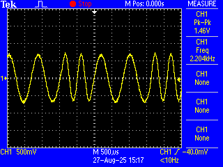
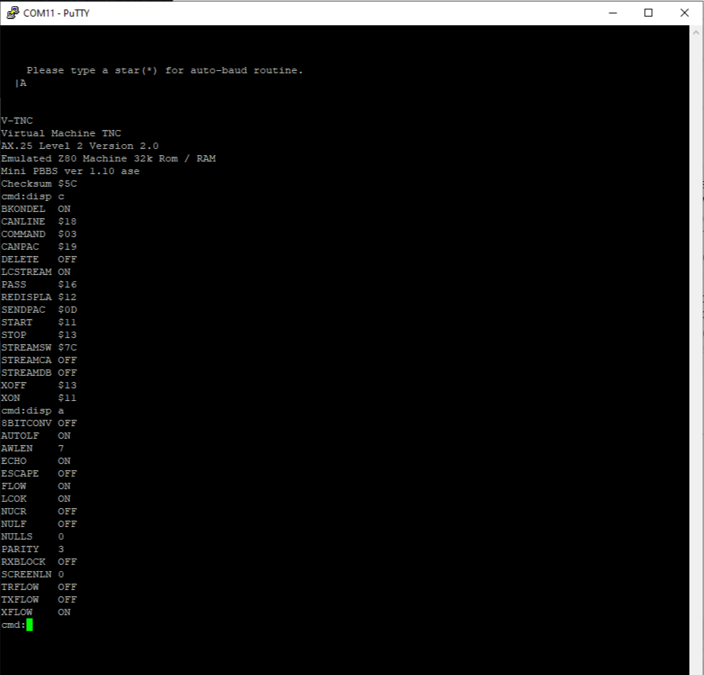
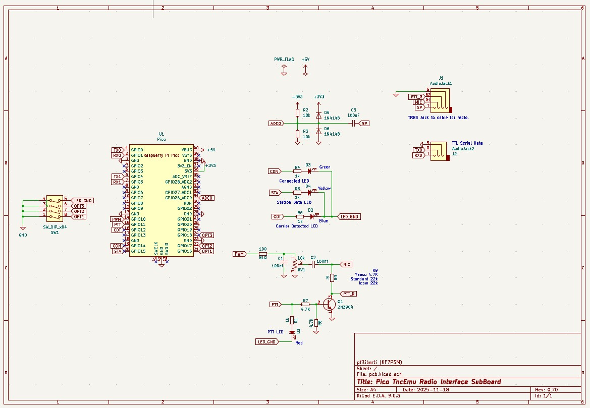

# PICO TNC

PICO TNC は、Raspberry Pi Pico を使用したアマチュアパケット無線用のターミナルノードコントローラー（TNC）です。  
このリポジトリは元のプロジェクトのフォークであり、モジュレーター／デモジュレーター部分を除く主要な機能をすべて削除し、私の TNCEMU プロジェクトから Z80 エミュレーターを組み込みました。  
このエミュレーターは Heathkit HK21 Pocket Packet をエミュレートします。現在はテスト用の実験的実装です。

## PIC TNC の特徴

- モデムチップを使用せずに Bell 202 AFSK 信号のエンコード／デコードが可能
- USB シリアルおよび UART シリアルインターフェースの両方に対応
- pbbs を含む完全な TNC 機能および TNC コマンドをエミュレート

## 今後の課題

- TNC のタイミングやパケット受信に関するテストのさらなる実施

## ビルド方法

- git clone https://github.com/amedes/pico_tnc.git
- cd pico_tnc
- mkdir build
- cd build
- cmake ..
- make -j4
-（'pico_tnc/pico_tnc.uf2' ファイルを Pico に書き込んでください

  
  

